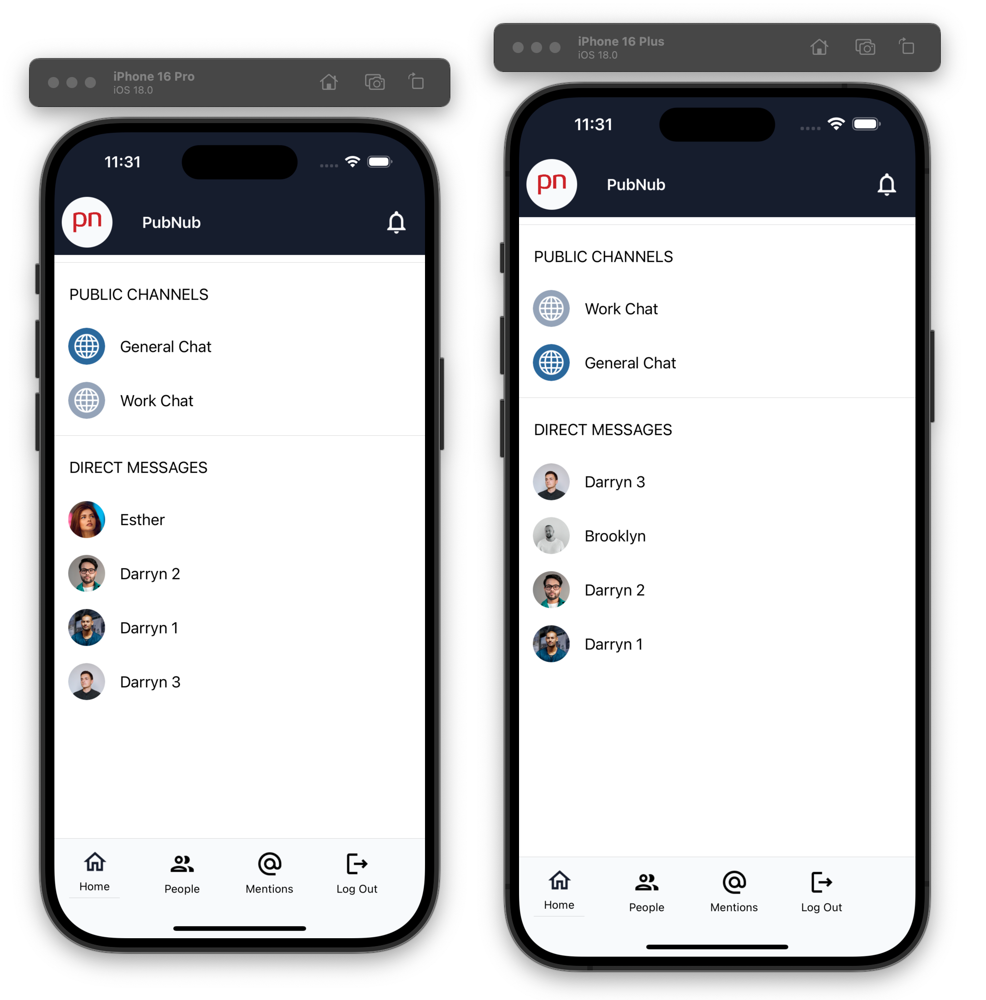
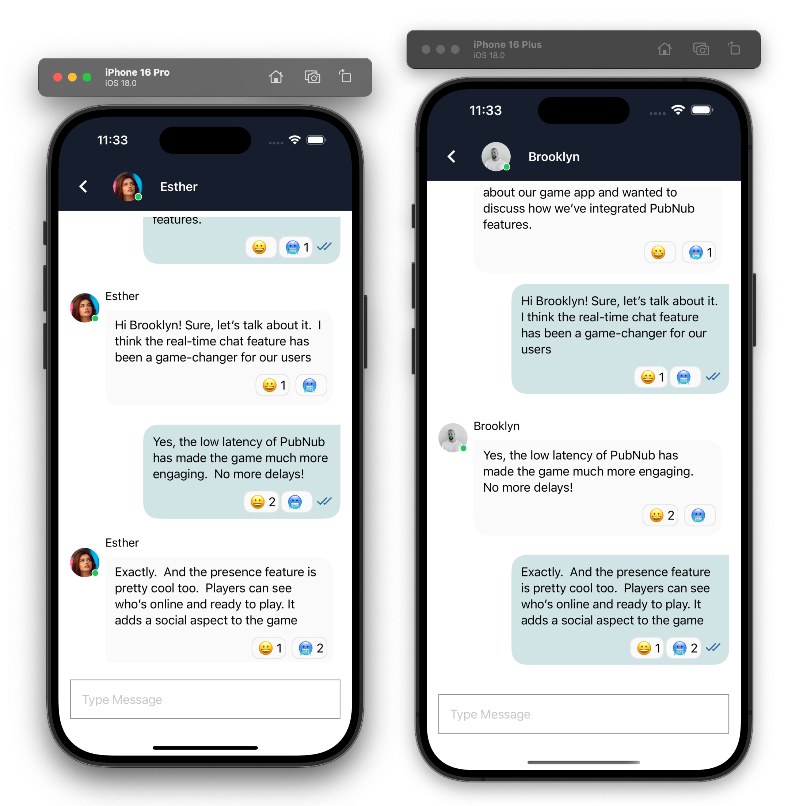
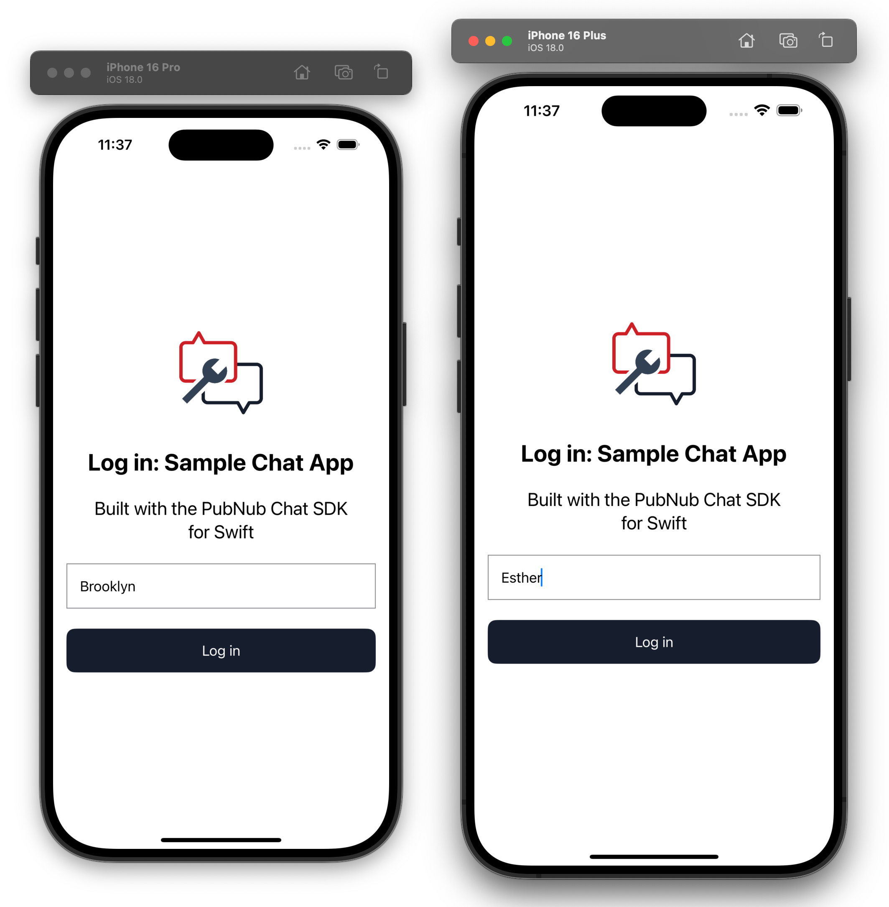

# Swift Chat SDK Tutorial

This application accompanies the Swift Chat SDK tutorial.  It is **not** designed to be a standalone demo for the Swift Chat SDK, it just illustrates some basic principles.

Please refer to **[https://www.pubnub.com/tutorials/chat-sdk/](https://www.pubnub.com/tutorials/chat-sdk/)** for the tutorial that accompanies this application.

## Features included in this application

- Chat initialization & PubNub Keys
- Creating a specific user and logging in as that user.
- Creating a public chat
- Creating a 1:1 (direct) chat
- Sending messages
- Loading historical message (persistence / message history)
- Typing indicator
- Message reactions
- Sent and read receipts

## Installation / Getting Started

This application is written with Xcode 16.0 but should compile with any recent version of Xcode.

To run this project yourself you will need a PubNub Account

### Get Your PubNub Keys

1. You’ll first need to sign up for a [PubNub account](https://admin.pubnub.com/signup/). Once you sign up, you can get your unique PubNub keys from the [PubNub Developer Portal](https://admin.pubnub.com/).

1. Sign in to your [PubNub Dashboard](https://admin.pubnub.com/).

1. Click Apps, then **Create New App**.

1. Give your app a name, and click **Create**.

1. Click your new app to open its settings, then click its keyset.

1. Enable the Stream Controller feature on your keyset (this should be enabled by default after you created the keyset)

1. Enable the Message Persistence feature on your keyset and choose a duration

1. Enable the App Context feature on your keyset.

1. Leave the File Sharing feature disabled.  Although the Chat SDK supports sending files, this demo app does not.

1. Copy the Publish and Subscribe keys and paste them into your app as specified in the next step.

## Building and Running

1. Clone the repository

1. Open the file `/PubNubSwiftChatSDKTutorial/PubNubSwiftChatSDKTutorial/Keys.swift`

1. Modify the strings `YOUR_PUBLISH_KEY_HERE` and `YOUR_SUBSCRIBE_KEY_HERE`, replacing them with your PubNub Publish and Subscribe keys.

Compile and run the application

## Using the Application

At the login screen choose a name.  This is a free form field and you don't need to register for an account or create a password.  Behind the scenes, a PubNub user ID is created based on your chosen name.

## Contributing

This repository is not open to feature requests but pull requests are always welcome for bugs. 